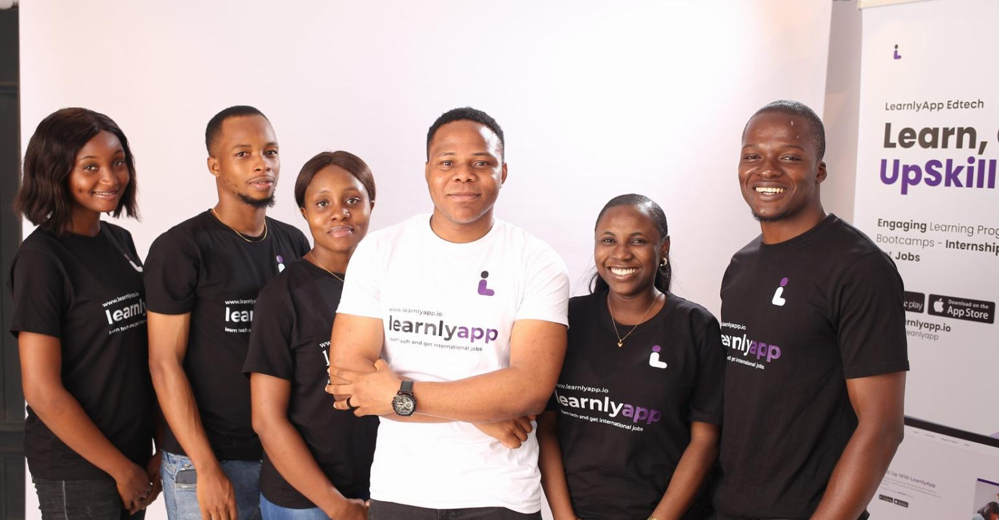

# Learnly-App tech Backend Bootcamp

## Welcome!!
Welcome to my GithHub repository for my coding bootcamp showcasing my learning and progrsiion in Learnly-App's Backend Bootcamp

# About Learnly-App Tech
LearnlyApp is an educational technology (EdTech) institute that is dedicated to helping individuals kickstart their career in tech. LearnlyApp offers a platform for organizations and tutors to create and offer in-demand tech courses in a much-improved way through a gamified approach, making it engaging and interactive for young Africans. We use a combination of research-backed teaching methods and engaging strategies to create courses that effectively teach in-demand tech skills.

# Vision
Empowering Africa’s Tech Future
 
Learnlyapp is the bridge that connects potential to opportunity. The transformative potential of tech education. We’re here to reshape how young Africans learn in a world where tech skills are crucial.

# Approach
Learnlyapp stands out through its innovative gamified approach. We believe learning should be an exciting adventure which is why our courses blend with interactive content, real world projects and research- backed teaching methods.

# Conclusion
Thank you for visiting my repo and i deeply grateful for the learning opportunities  provided from Learnly-App tech .

